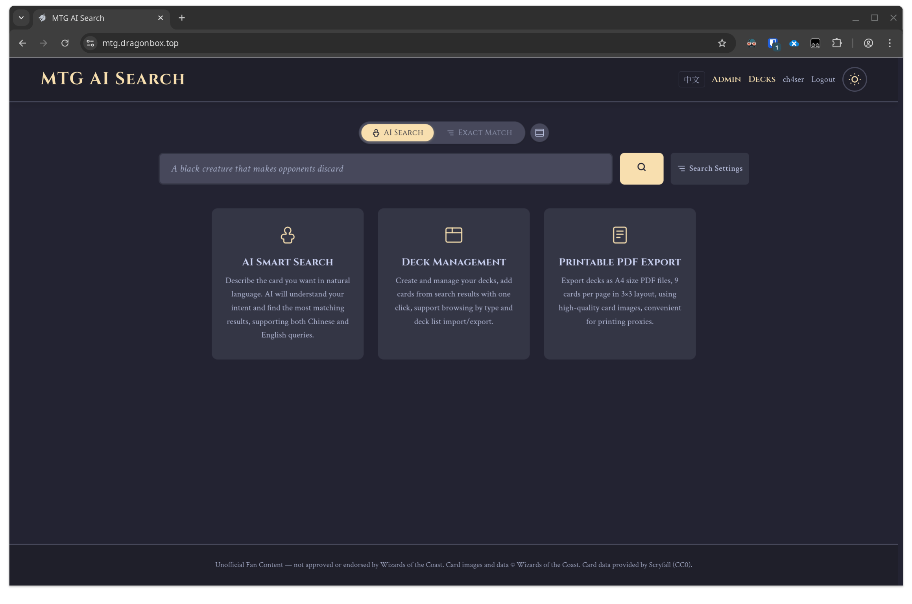
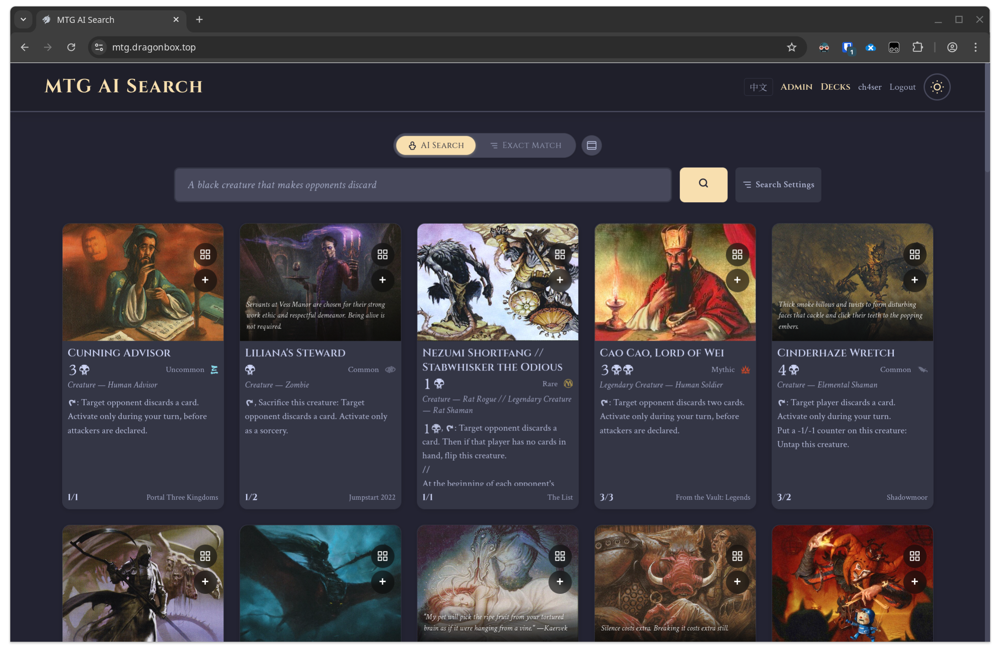
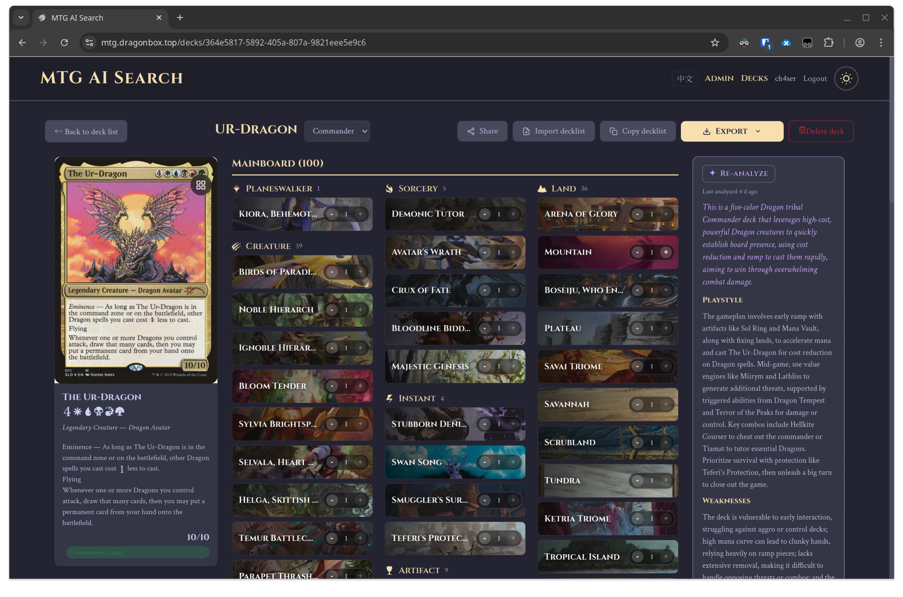

# MTG AI Search

An AI-assisted *Magic: The Gathering* card search and deck management app.
Describe gameplay effects in natural language — the system extracts structured
filters, matches your intent to Scryfall Tagger function tags via vector search,
and returns matching cards.

> 用自然语言描述你想要的万智牌效果。系统会抽取颜色、类别等筛选条件，
> 再通过向量搜索和 LLM 重排序匹配 Scryfall Tagger 功能标签，返回关联的卡牌。





## Features

- **AI Search.** Multi-stage pipeline: LLM extracts structured card filters and
  gameplay intent → vector search over function tag embeddings → LLM re-ranks
  candidate tags → PostgreSQL tag-card joins yield ranked results. Pagination is
  session-based so "load more" reuses the original search plan without extra LLM
  calls.
- **Exact Match.** Deterministic card search with filters for set, color, type,
  subtype, rarity, mana value, power/toughness, playtest cards, and keyword
  abilities. Set filtering supports bilingual lookup and displays the matching
  print version. Hovering a result shows bilingual explanations for its known
  keyword abilities. Returns facet counts for each filter dimension.
- **Random and similar cards.** Draw a random official card in a responsive
  spotlight dialog, or use a result card's context menu to find cards sharing
  any of its Scryfall Tagger function tags. Executed queries and Exact Match
  filters are encoded in the URL for sharing and browser navigation.
- **Bilingual card text.** English and 简体中文 UI. Chinese card names, types,
  oracle text, and flavor text are synced from MTGCH. Card images always use
  English Scryfall art. Switching the UI language instantly swaps displayed
  card text without re-fetching.
- **Deck management.** Create decks, import/export deck lists, share deck
  links, generate AI-powered deck analyses, and export A4 proxy PDFs or image
  ZIP bundles via SSE progress streams.
- **Admin console.** Dashboard stats, user management, rate-limit settings,
  Scryfall card sync (incremental + force), function tag-card link sync,
  tag expansion/embedding generation, Chinese card translation sync,
  keyword ability sync, card-data export, and sync logs.
- **External API.** API-key protected `/api/external/ai-search` and
  `/api/external/exact-match` endpoints for third-party integrations.
- **Auth.** JWT access/refresh tokens, email verification, password change (via email verification with Resend), and per-user API key management.

## Stack

| Layer       | Tech |
|-------------|------|
| Frontend    | React 18, Vite 6, React Router 7 |
| Backend     | FastAPI, LangChain (ChatOpenAI client for DeepSeek), Pydantic |
| Database    | PostgreSQL 17 with [`pgvector`](https://github.com/pgvector/pgvector) |
| LLM         | DeepSeek (configurable model) for constraint extraction, tag re-rank, tag expansion, and deck analysis |
| Embeddings  | Qwen3-Embedding-4B (2560-dim) via SiliconFlow API for tag vector search |
| Card data   | [Scryfall](https://scryfall.com/) bulk data (CC0) |
| Tag data    | Scryfall Tagger function tags and Scryfall search API results |
| Chinese text | [MTGCH](https://mtgch.com/) API |
| Email       | [Resend](https://resend.com/) (optional) |

## Quick Start (Docker)

Requires Docker + Docker Compose.

```bash
git clone https://github.com/ch4xer/MTG-AI-Search.git
cd MTG-AI-Search

cp .env.example .env
# Edit .env before starting.

docker compose up -d
```

Open:

- <http://localhost:60010>

During startup the backend initializes the database, imports card data, and
bootstraps tag expansions and embeddings. The frontend shows a maintenance
notice until the health check passes.

## Required Configuration

All variables live in `.env` (see [`.env.example`](.env.example)).

| Variable | Required | Purpose |
|----------|----------|---------|
| `POSTGRES_PASSWORD` | Yes | Compose-provisioned Postgres password. |
| `JWT_SECRET` | Yes | Signing key for auth tokens. Generate with `openssl rand -hex 32`. |
| `DEEPSEEK_API_KEY` | For AI features | Chat model for AI Search, tag expansion, deck analysis, and keyword summaries. |
| `DEEPSEEK_MODEL` | No | Chat model for all AI tasks; defaults to `deepseek-v4-flash`. |
| `DEEPSEEK_BASE_URL` | No | Defaults to `https://api.deepseek.com`. |
| `SILICONFLOW_API_KEY` | For AI Search | Embedding API key for vectorizing tag expansion text and search queries (model: `Qwen/Qwen3-Embedding-4B`). |
| `ADMIN_USERNAME` / `ADMIN_PASSWORD` | No | Bootstrap or promote a built-in admin account on startup. |
| `RESEND_API_KEY` | No | Enables email verification and password reset. |
| `ALLOWED_ORIGINS` | No | Comma-separated CORS allowlist. |

## Initial Setup Notes

On first launch the backend:

- prepares the database schema (users, decks, cards, tagger tags, etc.),
- creates or promotes the optional built-in admin user,
- imports Scryfall bulk card data if the database is empty,
- seeds keyword abilities,
- starts a background loop that generates function tag expansion text and
  embeddings in batches (controlled by `TAG_BOOTSTRAP_ENABLED`).

Once tag embeddings are ready, AI Search is fully functional. No manual
admin steps are required for the initial setup — the tag bootstrap runs
automatically in the background.

## Admin Maintenance

The admin database console exposes:

- **Keyword sync** — refreshes Exact Match ability filters from the
  comprehensive rules.
- **Function tag links** — syncs Scryfall Tagger function tags and their
  card associations for AI Search.
- **Function tag embeddings** — generates or regenerates tag expansion text
  (aliases, retrieval phrases, descriptions) and embedding vectors.
- **Chinese card info** — syncs missing Chinese card text from MTGCH.
- **Export card data** — downloads searchable card data as a ZIP.
- **Manual sync** — checks Scryfall bulk data `updated_at` and syncs if
  changed.
- **Force refresh** — ignores the timestamp and re-syncs immediately.
- **Settings** — adjusts anonymous and logged-in user hourly search rate
  limits (persisted to `app_meta`).

## Scheduled Jobs

- A daily card-data sync runs at midnight CST, checking Scryfall's bulk
  data `updated_at` and upserting new or changed cards.
- On startup, a tag bootstrap loop generates function tag expansion text
  and embedding vectors for any tags missing them. Once caught up it exits.
- Chinese card translation sync is triggered manually from the admin
  console only.

## Local Development

Backend (Python 3.12+, [`uv`](https://github.com/astral-sh/uv) recommended):

```bash
cd backend
uv sync
uv run uvicorn app.main:app --reload --port 8000
```

Frontend:

```bash
cd frontend
npm install
npm run dev          # http://localhost:5173
```

Both processes read environment variables from the project-root `.env`.

## Credits

- Card data and images © Wizards of the Coast.
  Provided as CC0 bulk data by [Scryfall](https://scryfall.com/docs/api/bulk-data).
- Scryfall Tagger tags and Scryfall search results power AI Search.
- Chinese card text via [MTGCH](https://mtgch.com/).
- Mana symbols: [`mana-font`](https://github.com/andrewgioia/mana) and
  [`keyrune`](https://github.com/andrewgioia/keyrune) by Andrew Gioia.
- Built with FastAPI, React, PostgreSQL/pgvector, DeepSeek, and LangChain.

## Disclaimer

Unofficial Fan Content permitted under the Wizards of the Coast Fan Content
Policy. Not approved or endorsed by Wizards. *Magic: The Gathering* and its
related properties are © Wizards of the Coast LLC.

## License

[MIT](LICENSE).
